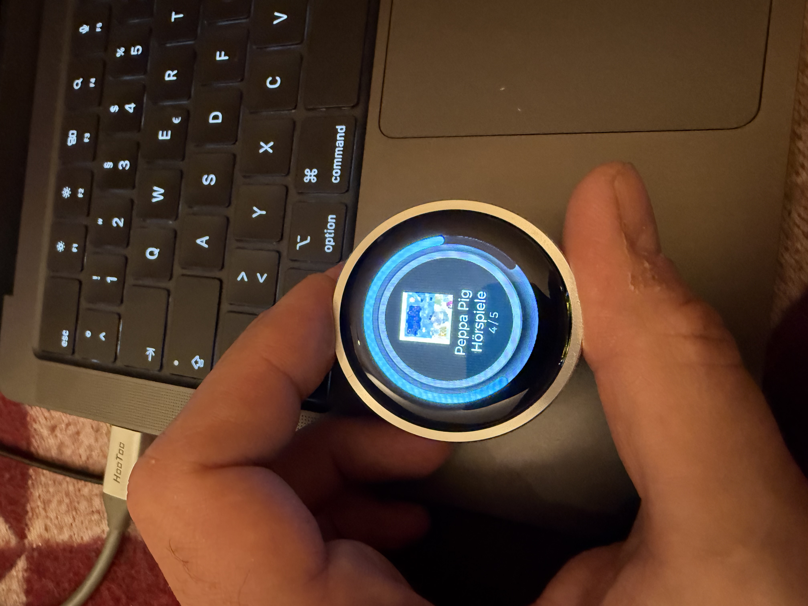

# NanoPod

An iPod-inspired audiobook controller for children using ESPHome and LVGL on a tiny round display.



## Why I Built This

*Built from the silence room in a spa, between Christmas and New Year's 2024.*

While my wife was reading, I was playing with Claude on my phone (forgot my book). The problem: our kid wakes up very early, and you don't want to give her a real screen. But a speaker and "something fenced" to control it? That could work.

There are tons of commercial options for kids' audio players, but they all come with subscriptions and limited content libraries. Since we're already on Spotify with all her audiobooks, I had the idea to create this little device. No soldering required - just flash and go.

**The entire project was built in conversation with [Claude](https://claude.ai).** I started with the regular Claude app to research the hardware and generate a detailed briefing document (included in this repo as `briefing.md`). Then I fed that briefing into [Claude Code](https://claude.ai/claude-code) which implemented everything - from hardware config to the final UI. Pure ESPHome YAML, no C++ needed.

For the UI design, I used [SquareLine Studio](https://squareline.io/) to visually design the circular interface with nested rings and shadows (project files in `squareline/`). Then I simply asked Claude to convert the exported C code to ESPHome LVGL YAML - it translated all the widget properties, colors, and layout perfectly.

## Overview

NanoPod is a simple, child-friendly audiobook controller that connects to [Music Assistant](https://music-assistant.io/). Turn the wheel to browse, click to play - just like an iPod. No phone needed, no complicated apps.

### Features

- **iPod-style navigation** - Rotary encoder for browsing, click to select
- **Touch gestures** - Swipe left/right to browse, tap to select, swipe up to go back
- **Cover art display** - Shows album artwork from Music Assistant
- **Progress indicator** - Outer arc shows playback position
- **Volume control** - Turn wheel during playback to adjust volume
- **Sleep mode** - Display dims after inactivity
- **OTA updates** - Update firmware over WiFi

## Hardware

### CrowPanel 1.28" HMI ESP32 Rotary Display

| Component | Specification |
|-----------|---------------|
| Display | GC9A01A 240x240 round LCD |
| MCU | ESP32-S3 (16MB Flash, 8MB PSRAM) |
| Input | Rotary encoder with push button |
| Touch | CST816S capacitive touchscreen |
| LEDs | 5x WS2812 RGB (optional) |

**Where to buy:** [Elecrow](https://www.elecrow.com/crowpanel-1-28-inch-hmi-esp32-rotary-display.html) | [AliExpress](https://aliexpress.com/item/1005007486033636.html)

## Requirements

- [ESPHome](https://esphome.io/) 2024.x or later
- [Music Assistant](https://music-assistant.io/) server
- WiFi network

## Installation

1. **Clone the repository**
   ```bash
   git clone https://github.com/tobsch/nanopod.git
   cd nanopod
   ```

2. **Configure secrets**

   Create `secrets.yaml`:
   ```yaml
   wifi_ssid: "YourWiFiName"
   wifi_password: "YourWiFiPassword"
   ap_password: "fallback-ap-password"
   api_key: "your-esphome-api-key"
   ota_password: "your-ota-password"

   # Music Assistant
   ma_url: "http://your-music-assistant:8095"
   ma_player: "your_player_id"
   ```

3. **Flash the firmware**
   ```bash
   esphome run nanopod.yaml
   ```

## Usage

### Navigation

```
HOME (Artist/Series carousel)
  │
  ├── Turn wheel / Swipe L/R → Browse artists
  └── Click / Tap / Swipe down → Enter albums

ALBUMS (Album list)
  │
  ├── Turn wheel / Swipe L/R → Browse albums
  ├── Click / Tap / Swipe down → Play album
  └── Long press / Swipe up → Back to HOME

PLAYER (Now playing)
  │
  ├── Turn wheel / Swipe L/R → Adjust volume
  ├── Click / Tap → Play/Pause
  └── Long press / Swipe up → Stop & back to ALBUMS
```

### Display Elements

- **Center**: Cover art and track info
- **Outer ring**: Playback progress (cyan arc)
- **Volume bar**: Appears when adjusting volume

## Configuration

### Music Assistant Setup

NanoPod fetches content from Music Assistant using the library filter configured in `nanopod.yaml`:

```yaml
substitutions:
  ma_library_filter: "audiobook"  # Filter for audiobook content
```

Adjust the filter to match how your audiobooks are tagged in Music Assistant.

### Customization

Key settings in `nanopod.yaml`:

| Setting | Description |
|---------|-------------|
| `sleep_timeout_ms` | Display sleep timeout (default: 60000ms) |
| `volume_display_ms` | Volume indicator display time (default: 2000ms) |
| `ma_library_filter` | Music Assistant content filter |

## Project Structure

```
nanopod/
├── nanopod.yaml          # Main ESPHome configuration
├── hardware-test.yaml    # Hardware verification config
├── secrets.yaml          # WiFi, API keys (create this)
└── images/               # Documentation images
```

## Troubleshooting

### Display not turning on
The CrowPanel requires explicit power rail activation. This is handled in `on_boot` - ensure the power switches are configured correctly.

### Can't connect to Music Assistant
- Verify `ma_url` in secrets.yaml points to your MA server
- Check that the `ma_player` ID matches your speaker in Music Assistant
- Ensure the ESP32 is on the same network as Music Assistant

### Touch not working
The CST816S touch controller shares I2C with other peripherals. Ensure GPIO5 (INT) and GPIO13 (RST) are correctly configured.

## License

MIT License - See [LICENSE](LICENSE) for details.

## Acknowledgments

- **[Claude](https://claude.ai)** - AI pair programmer that built this entire project with me
- [ESPHome](https://esphome.io/) - The foundation
- [LVGL](https://lvgl.io/) - Graphics library
- [Music Assistant](https://music-assistant.io/) - Media backend
- [Elecrow](https://www.elecrow.com/) - Hardware
